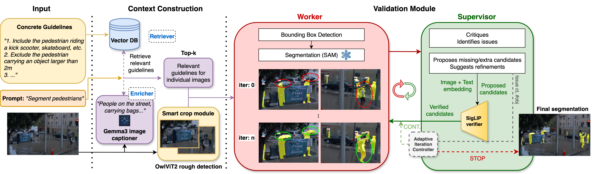

# GuideSeg

[[Paper](https://arxiv.org/abs/2509.04687)] [[Project](https://guideline-seg.github.io/)]

Official implementation of GuideSeg, a training-free framework for guideline-consistent semantic segmentation through multi-agent refinement.

A Worker VLM proposes object boxes, SAM 2.1 converts them into masks, and a Supervisor VLM critiques the predictions and provides feedback. A lightweight reinforcement-learning controller determines when to stop the bounded refinement loop.

The output consists of semantic segmentation masks that follow the supplied textual labeling guidelines.

Datasets: 
- Waymo: Guideline-consistent set paths can be found in ```waymo_paths.txt``` 
- ReasonSeg: Official validation set [Link](https://github.com/JIA-Lab-research/LISA#dataset)
---
## Overview pipeline



---
## Setup

```bash
conda create -n guideseg python=3.11 
conda activate guideseg
pip install -r requirements.txt
```
Currently split on RTX 3x3080 GPUs. Can also work on a single more powerful one.

The project is currently set up to work with Gemini-2.5-flash API. Would require necessary input/output modifications to work with the other models.

You would need to put in your own Gemini keys in ```main_waymo.py``` or ```main_reasonseg.py```.

```python
client = genai.Client(api_key='your_api_key')
```
---
### Model weights

| Model | Used for |
|---|---|
| `sam2.1_hiera_large` | masks, fetched from the SAM 2 release URL |
| `google/gemma-3-4b-it` | crop captions that form the retrieval query (Huggingface gated repo) |
| `google/owlv2-base-patch16-ensemble` | zoom-crop proposal |
| `google/siglip-base-patch16-224` | validator gate on supervisor candidates |
| `all-MiniLM-L6-v2` | guideline embeddings |

---

## Run

```bash
python3 main_waymo.py --input_folder ./data --output_folder ./output
```
images will be in the structure: ```*/images/*/*/*.jpeg```

```bash
python3 main_reasonseg.py --input_folder ./data --output_folder ./output
```
images will be in the structure: ```*.jpg```

---
## Where things live

| Modules| Roles |
|---|---|
| `src/modules/worker.py` | Gemini boxes + SAM masks + applying supervisor feedback |
| `src/modules/supervisor.py` | critique (missing/false positives/refinements) |
| `src/modules/validator.py` | SigLIP gate on supervisor candidates |
| `src/modules/retriever_enricher_gemma.py` | Gemma captioner + FAISS guideline retrieval |
| `src/utils/zoom_crop.py` | OWLv2 crop proposal |
| `src/utils/iter_controller.py` | stop/continue agent, `MIN_ITERS` / `MAX_ITERS`, rewards |
| `instructions/system.json` | prompts and JSON schemas for the worker/supervisor roles |
| `instructions/waymo/waymo_guidelines.json`| the labeling rules |

---
## Citation
If you find this project useful in your research, please consider citing:
```
@inproceedings{vats2026guideline,
  title={Guideline-consistent segmentation via multi-agent refinement},
  author={Vats, Vanshika and Rathee, Ashwani and Davis, James},
  booktitle={Proceedings of the AAAI Conference on Artificial Intelligence},
  volume={40},
  number={12},
  pages={9612--9620},
  year={2026},
  doi={10.1609/aaai.v40i12.37923}
}
```
---
## Acknowledgements
We appreciate and utilize the awesome works by [Gemini-2.5](https://arxiv.org/abs/2507.06261), [SAM2](https://github.com/facebookresearch/sam2), [langsam](https://github.com/luca-medeiros/lang-segment-anything).
